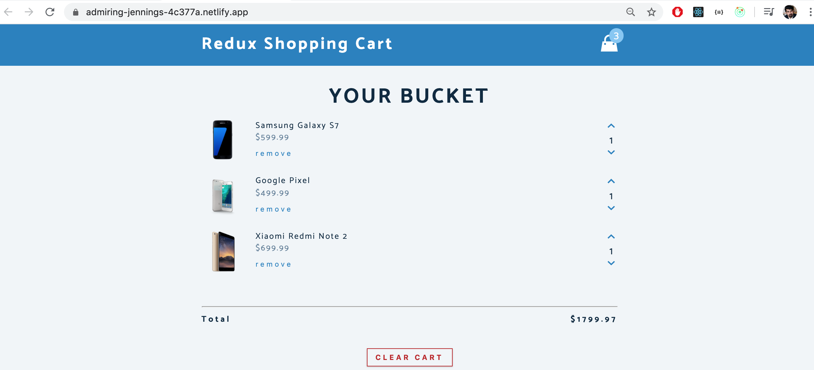
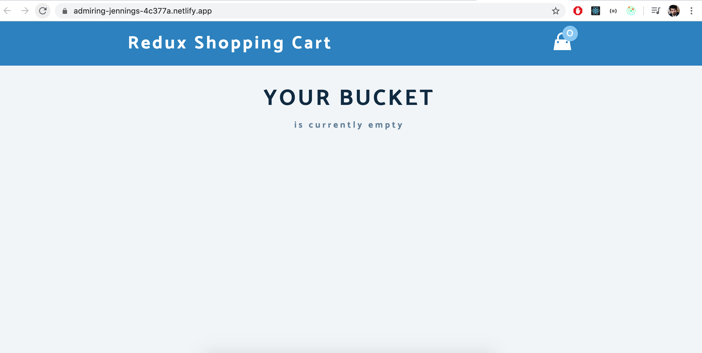

# Redux Shopping Cart ⚡️  

## A clean, beautiful and responsive Redux Shopping Cart for React Developers!

 
  <kbd>
  	<a href="https://admiring-jennings-4c377a.netlify.app/" target="_blank">
		</img>
	</a>
  </kbd>

## Empty Cart 

 
  <kbd>
  	<a href="https://admiring-jennings-4c377a.netlify.app/" target="_blank">
		</img>
	</a>
  </kbd>

## Sections 
✔️ Increase the Number of Porduct\
✔️ Descrease the Number of Porduct \
✔️ Remove the Products from Cart\
✔️ Show Total Products in Cart\
✔️ Clear whole Bucket List \

## Technologies used 🛠️

- [React](https://reactjs.org/)
- [Redux](https://redux.js.org/) 

## Contributors ✨
<table>
  <tr>
    <td align="center"><a href="https://github.com/AbdulWahab0"> <b>Abdul Wahab</b></a> <a href="https://github.com/AbdulWahab0" title="Code">💻</a> <a href="https://github.com/AbdulWahab0" title="Documentation">📖</a> <a href="#design-ashutosh1919" title="Design">🎨</a> <a href="#maintenance-ashutosh1919" title="Maintenance">🚧</a></td>
  </tr>
</table>
 
